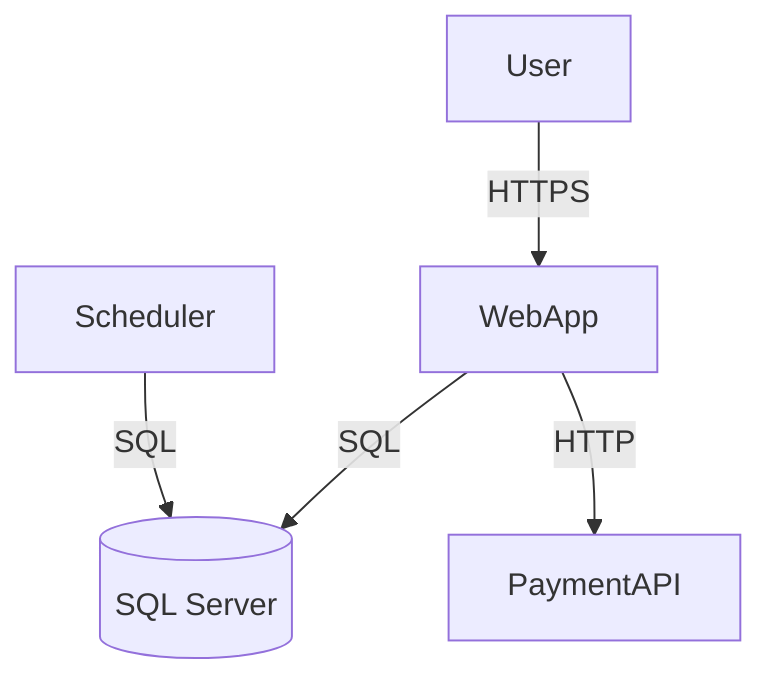

# Hotspot Analysis

STARTER_CHARACTER = 🔬

When starting, announce: "🔬 Using HOTSPOT-ANALYSIS skill".

## The Core Principle

A messy file untouched for 3 years is low priority. A messy file that changes every week and accumulates bugs is a crisis.

Hotspot = high churn × high complexity × high defect density. Work in that order.

## Step 1: Extract Churn from Git

Files changed most frequently in the last 6–12 months:

```bash
git log --since="6 months ago" --format=format: --name-only | grep -v '^$' | sort | uniq -c | sort -rn | head -20
```

Scope to a specific module:
```bash
git log --since="6 months ago" --format=format: --name-only -- src/ | grep -v '^$' | sort | uniq -c | sort -rn
```

## Step 2: Extract Defect Density

Files most frequently touched by bug-fix commits:

```bash
git log --since="6 months ago" --format=format: --name-only --grep="fix\|bug\|error\|hotfix\|patch" -i | grep -v '^$' | sort | uniq -c | sort -rn | head -20
```

Files appearing in both churn and defect rankings are your highest-risk targets.

## Step 3: Measure Complexity

`lizard` works across C#, JS, TS, Python, Java and outputs cyclomatic complexity per function:

```bash
pip install lizard
lizard src/ --sort cyclomatic_complexity -l csharp
lizard src/ --sort cyclomatic_complexity -l javascript
```

Language-specific alternatives:
- **C# / .NET**: Visual Studio Code Metrics, NDepend (commercial), or `dotnet` with Roslyn analyzers
- **TypeScript / JS**: ESLint `complexity` rule (`"complexity": ["warn", 10]`), or `plato` for HTML reports

## Step 4: Build the Hotspot Matrix

Rank each file by churn, defect density, and complexity. Multiply ranks. Sort ascending — lowest score = highest priority.

```
File                      | Churn | Defects | Complexity | Score
OrderProcessor.cs         |   1   |    1    |     2      |   2   ← start here
UserAuthService.ts        |   2   |    3    |     1      |   6
LegacyReportGenerator.cs  |   8   |    7    |     1      |  56   ← leave it alone
```

Top 5–10 files by score are your hotspots. Everything else is noise.

## Step 5: Map the System (C4 Model)

Before touching hotspots, understand what talks to what. Use only the first two levels:

**Level 1 — Context**: Your system + external actors (users, APIs, other systems). Answer: what does it do and who uses it?

**Level 2 — Containers**: Deployable units (web app, API, DB, queue, scheduler) and the protocols between them. Answer: what are the moving parts?

Skip Levels 3 and 4 until actively refactoring a specific container.



## Step 6: Start Using ADRs

Every architectural decision from today gets a short Markdown file in `docs/adr/` or `decisions/`:

```markdown
# ADR-001: Use Strangler Fig to replace OrderProcessor

## Status
Accepted

## Context
OrderProcessor.cs has the highest hotspot score. Direct refactoring is too risky without tests.

## Decision
Introduce IOrderProcessor interface, route new flows to new implementation, keep legacy as fallback.

## Consequences
- New flows are testable and typed
- Legacy code stays until traffic is fully migrated
- Adds one abstraction layer
```

Number ADRs sequentially. Never delete — mark old ones as Superseded.

## Credits

Hotspot analysis: Adam Tornhill, *Software Design X-Rays* (Pragmatic Bookshelf, 2018).
C4 Model: Simon Brown — c4model.com
